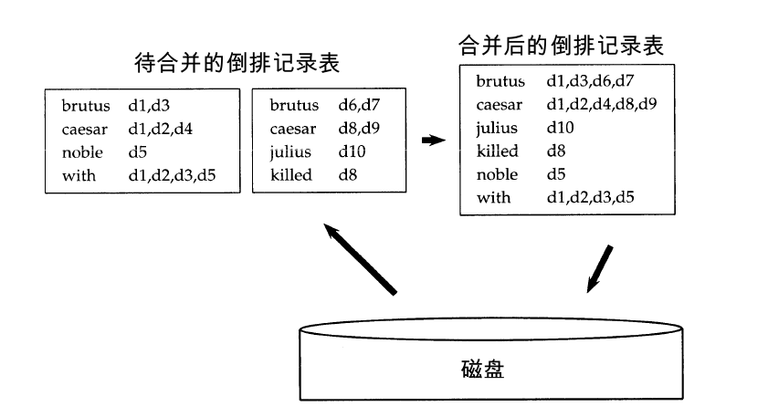
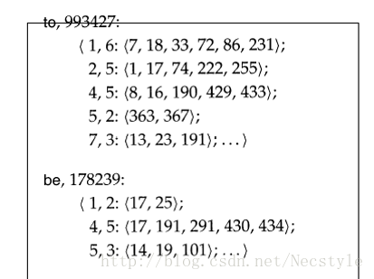
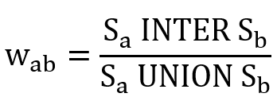
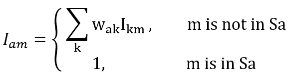
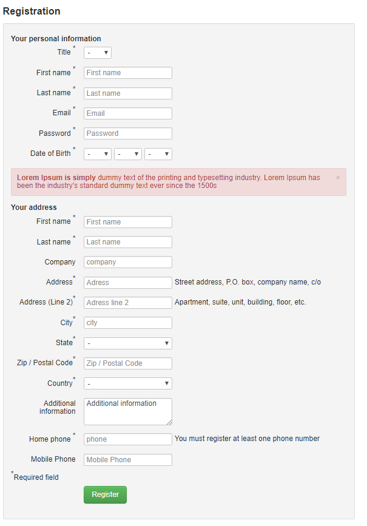
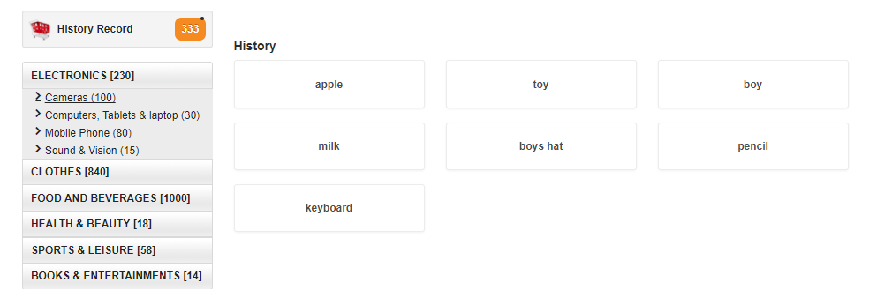

# Information Retrieval System for Amazon Products

**Our project for IR Intro course (2018).** 
**Instructor: Prof. Chen.**
**Team members: Siqi Jiang, Sibei Chen, Daren Chao**

**Attention:** Download input file from following link if you wanna run this program :
https://pan.baidu.com/s/1jWJ9FVVLAHSJ5BoBCFtyYA

---

### 目的：

> 1. 系统能够为一个文本集合创建带有位置信息的倒排索引。

> 2. 系统能够根据单个词语搜索相应的文件，支持短语（包含两个或多个单词）查询，能够对搜索到的文件与查询语句之间的关联度进行分析与排序，并按照关联度排序 （降序）显示搜索到的文件。 
> 3. 系统能够支持一些更高级的用户交互功能。
> 
> 4. 用户交互界面：  
>  - 让用户指定需索引的文件目录
>  - 让用户输入搜索内容
>  - 显示搜索到的文件名

> 5. 其他能够提升索引与搜索质量的功能。

### 步骤：

> - 爬取数据  
爬取amazon网站上的商品信息(名称、价格、介绍)、购买信息(购买数目、评价)等，放置在json文件中(之后会有实例)
> 
> - 建立数据库  
最开始可以先将json文件当作一个简单的文本数据库  
在建立索引之前对搜索文档进行预处理  
预处理建立在自己对系统的需求上，包括切分文档、美化格式、替换字符、格式转换等
> 
> - 建立索引  
取得一个搜索文档，添加Field(文件名、文件内容等)
> 
> - 搜索  
搜索关键字和搜索类型统称Term，即一个搜索单元
> 
> - 返回有价值信息  
并对得到的文档进行排序
>
> - 完善其他方面  
自动纠错功能、基于用户信息的推荐
>

### 代码说明

代码组织结构如下：

	Amazon
	|-- Amazon
	|   |-- __init__.py
	|   |-- search.py     # 视图文件
	|   |-- settings.py   # Django项目的设置
	|   |-- urls.py       # Django项目的URL声明
	|   |-- wsgi.py
	|-- IR
	|   |-- input  
	|   |   |-- doc_data      # 商品的json信息
	|   |   |-- index_data    # 倒排索引表
	|   |   |-- doc_cat_data  # 按类别存放的商品json信息
	|   |-- __init__.py
	|   |-- conf.py       # 相关参数设置
	|   |-- corrector.py  # 自动纠错程序
	|   |-- index.py      # 索引表构建及写入、读取程序
	|   |-- search.py     # 搜索排序程序
	|   |-- util.py       # 相关工具
	|-- Database
	|   |-- __init__.py
	|   |-- admin.py      # 管理员界面信息
	|   |-- apps.py
	|   |-- models.py     # 数据库结构
	|   |-- tests.py
	|   |-- views.py

倒排索引表的生成、构建、写入文件、从文件读取等程序在 **IR/index.py** 中。

基于倒排记录的查询以及排序等程序在 **IR/search.py** 中，包括了:

 - **二元临近词查询**
 - **基于tf-idf权重改进的查询**
 - **基于簇以及余弦相似度的查询扩展算法**
 - **基于商品星级的查询算法**
 - **基于同义词或者近义词对查询进行扩展**
 - **基于用户搜索记录的协同过滤推荐算法**

## 建立索引

构建倒排索引，具体过程参照下图：

为了之后的查询操作，我们实际采用的是基于位置信息的倒排索引，参照下图：

这里我假定每一个doc都是有id的，我们称之为doc\_id。除此之外，还定义了一些其他的量，例如word\_id，以及：

	self.word_set = set()  # all words
	self.word2id_map = {}  # map : word -> word_id
	self.index = {}  		# map & set : word_id -> doc_id -> positions
	self.D = 0              # int : The total number of documents
	self.W = 0              # int : The total number of words

由于数据并不太多，目前假定内存是可以处理整个的index的。

构建单词表的时候，采用了set的方式，因为set的合并、删除、判断是否存在等操作效率更高。
在构建索引表的时候，采用了两层dictionary的方式，原因是diction基于哈希表，查找速度超过list。
我们自己定义了一个数据结构用来存储位置信息：

	class doc_position:
    	def __init__(self, doc_id):
    	    self.doc_id = int(doc_id)   # document's id
    	    self.occur = 0     # the number of occurrences of this word
    	    self.pos = set()         # position of each occurrence

将索引表写入文件的时候使用了python的pickle库，将index、word\_set、word2id\_map序列化后存放在文件中，并用zlib对索引文件进行了压缩，例如：

	with open(conf.index_path, 'wb') as out_file:
		out_file.write(pickle.dumps(self.index))
		compress(conf.index_path, conf.index_path)

代码在 **index.py** 里。

## 搜索程序

**search.py** 中是搜索程序，可以加入函数实现自己的搜索算法。其中包含Search类，只有一个类变量：self.index\_arr，这是一个index数组

index的格式是双层字典：word\_id -> doc\_id -> positions，即：index[word\_id][doc\_id] = doc\_position

doc_position的定义在 **util.py** 中.
	
在类中可以创建自己的函数：

	def other_method(self):
        pass

在main中可以运行自己的算法，注意修改以下部分：

    search = Search(index_arr)
    result = search.your_algorithm(your_parameters)

## 搜索算法

搜索是基于查询Q、文档D和文档集合C的相关度计算，相关度R=f(Q,D,C)

已经实现了二元临近词查询，在交互界面上表现为支持双引号的短语查询

也实现了基于tf-idf的文档评分方法改进的搜算算法

在此基础上准备实现查询扩展与查询重构：

- 基于贝叶斯推断的**拼写纠正**(Spelling Correction)算法
- **查询扩展**(Query Expansion)： 利用同义词或者近义词对查询进行扩展，基于wordNet
- **查询重构**(Query Reconstruction)： 利用用户的相关反馈信息对查询进行修改
- 对于**通配符查询**(Wildcard Query)问题，可以采用k-gram方法进行解决，但是通配符查询在这里用处不大，因此没有进行实现

### 一、拼写纠正

针对拼写纠正问题，使用了Peter Norvig的基于贝叶斯推断的拼写纠正算法: 
[http://norvig.com/spell-correct.html](http://norvig.com/spell-correct.html "Peter Norvig的纠正算法")

算法思路：

**1 对单词进行处理，给出单词的各种可能形式：**

 - 原单词
 - 原单词进行拆分
 - 删除其中的一个/两个字母
 - 交换其中相邻的一对/两对字母
 - 将其中的一个/两个字母替换成别的字母
 - 插入一个/两个字母

**2 对每种可能形式放入语料库中，算出其出现的概率，选择其中概率最大的那一个**

原理：

用户输入了一个单词，这时分成两种情况：拼写正确或者拼写不正确。
我们把拼写正确的情况记做 c，拼写错误的情况记做 w。
拼写检查就是在发生 w 的情况下，试图推断出 c。
从概率论的角度看，就是已知 w，然后在若干个备选方案中，找出可能性最大的那个 c，也就是求下面这个式子的最大值：

	P(c|w)

根据贝叶斯定理：

	P(c|w) = P(w|c) * P(c) / P(w)

对于所有备选的 c 来说，对应的都是同一个 w ，所以它们的 P(w) 是相同的，因此我们求的其实是：

	P(w|c) * P(c)

P(c) 的含义是，某个正确的词的出现"概率"，它可以用"频率"代替。如果我们有一个足够大的文本库，那么这个文本库中每个单词的出现频率，就相当于它的发生概率。某个词的出现频率越高，P(c) 就越大。

P(w|c) 的含义是，在试图拼写 c 的情况下，出现拼写错误 w 的概率。这需要统计数据的支持，但是为了简化问题，我们假设两个单词在字形上越接近，就有越可能拼错，P(w|C) 就越大。举例来说，相差一个字母的拼法，就比相差两个字母的拼法，发生概率更高。你想拼写单词 hello，那么错误拼成 hallo（相差一个字母）的可能性，就比拼成 haallo 高（相差两个字母）。

代码在 **corrector.py**

### 二、基于tf-idf权重改进的查询以及文档评分(原创)

tf-idf是常用的词权重的计算方法

	tf = number of occurrences of a word in an article / total number of articles
    idf = log (the total number of documents in corpus / (number of documents containing the word + 1)

统方法对文档评分使用的是

	score = Σ(each query word in this doc)(tf-idf weight of specific word)

我发现如果单纯的使用tf-idf作为权重，最后得到的评分不一定能够很好的适应我们当前的场景。主要是以下两个问题：

 - 用户其实更希望的是尽可能多覆盖所有的关键词，而这里可能会使得只覆盖部分权重过高关键词的文档评分过高
 - 文档中尽可能多出现关键词的意义不是特别大

因此我们针对这些问题对方法做了一些改进：

 - 优先返回覆盖了所有关键词的文档
 - 如果这些文档没有达到预定义值k个，那么对剩余的文档进行基于tf-idf权重的评分

结果出奇的不错，不仅解决了上述问题，而且使得排名更偏向于用户希望的结果，算法描述如下：

	Query: list of words
	Get score of each document:
		score[doc_id] = Σ(all query words in this doc)(tf-idf weight of specific word)
	Get max score from all docs: max_score
	Get the number of query words covered by each doc: covered_words
	For each docs' scores: 
		score[doc_id] = score[doc_id] + max_score * covered_words[doc_id]
	sort score array by score of each doc 
	result = score[0:k], k is the number of results returned

代码在 **search.py.Search.tf\_idf\_arrange**

### 三、基于簇以及余弦相似度的查询扩展算法(原创)

在查询中我们可能会遇到一些问题，比如：

 - 根据关键词返回的结果项的数目并不能达到要求，需要进行结果扩展
 - 用户得到的结果的种类过于繁杂，可以进行分类重现

如下图，我们的文档已经具有的类别，因此我们可以在每个簇中应用余弦相似度进行结果扩展，这里我们提出了自己解决这些问题的算法：

1. 首先通过一般查询得到一个结果集合，同时得到这些结果的所属类别(在我们的项目中就是亚马逊网站为其标注的所属类别)
2. 我们给定这里出现的每一种类别一个权重：w_category = frequency of the category
3. 通过每个类别的权重，确定从每个类别中衍生出的文档数目
4. 针对每个类别的结果集合，计算其中所有文档对应查询结果文档的余弦相似度：这里的余弦相似度不同于一般的向量之间的相似度，由于结果集合是多个文档，因此我们通过每个词语的频率给定其权重，之后再计算余弦相似度

由于算法中基于文档类别(簇)，我们需要提前保存好文档的簇信息，这里使用不同的文件进行保存，使用索引对类别进行表示

代码在 **search.py.Search.cluster_extend**

### 四、基于商品星级的查询算法(原创)

传统排名算法中没有考虑商品的星级属性。

亚马逊会给所有商品一个星级(1~5stars)，这是根据用户打分取平均值得到的，可以用来评判商品的好坏，我们在数据库中会存储这个值。

我们将商品的星级作为其中的一个特征，根据商品名称的相关性、覆盖单词数目、星级共同影响一个商品的得分

	Query: list of words
	Get score of each document:
    	score[doc_id] = Σ(all query words in this doc)(tf-idf weight of specific word)
	Get max score from all docs: max_score
	Get the number of query words covered by each doc: covered_words
	For each docs' scores: 
	    score[doc_id] =	score[doc_id] + 
				max_score * (covered_words[doc_id] / all_words) + 
				max_score * (star[dic_id] / 5)
	sort score array by score of each doc 
	result = score[0:k], k is the number of results returned

代码在 **search.py.Search.star_arrange**

### 五、基于同义词或者近义词对查询进行扩展(原创)

用户在查询中可能会遇到一些问题，比如：

 - 根据关键词返回的结果项的数目并不能达到要求，需要进行结果扩展
 - 无法获得描述相似的物品

为了解决上述的问题我们运用了wordnet来引用同义词扩展结果：

1. 首先判断结果是否是大于k的（初始k设为5）
2. 若结果小于k，则需要扩展.
3. 通过对每个关键词的不同意义的同义词搜索扩展结果

代码在test.py

### 六、基于用户搜索记录的协同过滤推荐算法(原创)

我们希望通过比较每个用户的搜索记录，判断用户之间的相似性，找到相似度最高的k个用户，并通过多用户比较排序搜索的词，给出推荐物品。此处只列出三个。

首先我们计算用户之间的相似度：

其中Sa是用户a搜索过的词，Sb是用户b搜索过的词，他们的交集表示他们共同搜索过的词，他们的并集表示他们所有搜索过的词的集合，比值代表他们的相关性。

当我们对用户a进行相关用户推荐时，我们取与a相似度最大的k个用户，提取出他们的并集，即：

A = S1  UNION S2  UNION S3 ... UNION Sk

其中Si， i属于[0,k]，表示相似度最大的k个用户搜索过的单词的集合。

我们对A中的单词计算用户对它的感兴趣程度：

其中k表示相似度最大的k个用户，m表示一个搜索单词，Iam表好似用户a对物体m的感兴趣程度，它由k个相似用户对它的感兴趣程度加权而得，权重是相似度w。 这里简化起见，已经搜索过的话感兴趣程度为1，Ikm在没有搜索的情况下为0。所以这个加权过程不会递归下去，他就是搜索过的用户的相似度w的累加。

通过 Iam 的排序，选择前三的搜索单词，再通过搜索算法得到product，显示在页面布局上。

## 爬虫

首先，使用scrapy模块爬取了5月15日的Amazon Best Sellers榜单，按照类别每种爬取了100个商品，并将其直接保存在了json中。
我使用的网站是https://www.amazon.com/Best-Sellers/zgbs/ref=zg\_bs\_tab
代码在SPIDER/amazon中。

分类是按照两级分类：

	 - Amazon Devices & Accessories
    	 - Amazon Devices
    	 - Amazon Device Accessories
	 - Amazon Launchpad	
    	 - Body
    	 - Food
    	 - Gadgets
    	 - House
    	 - Toys
	 - Appliances
	  ...

爬取的json数据格式为：
	
	{
		"id": 100000001,
		"title": "Striped Boho Long Dress,Clearance! AgrinTol Womens Summer Plus Size Striped Boho Long Dress (XXL, Black)", 
		"url": "https://www.amazon.com/Striped-Dress-Clearance-AgrinTol-Womens/dp/B07BGV2V2B?_encoding=UTF8&psc=1",
		"cat": {"1": "Software", "2": "Tax Preparation"},
		"price": "$3.21",
		"picture": "https://images-na.ssl-images-amazon.com/images/I/61FS0sCLeSL._SY450_.jpg",
		"star": "3.5 out of 5 stars", 
		"reviewers": "355 customer reviews", 
		"questions": "28 answered questions"
	}
之后我们又爬取了特定类的商品，包括 Amazon fashion、food、hardware
Amazon fashion 的分类：
 	
	- women
	 	- clothing
			- dresses
				-casual
				- club&night out
				......
			- sweaters
			- jeanes 
			- skirts
			.......
    		 - shoes
    		 - jewelry
		 ......
	 - man
    	 - girls
    	 - boys
    	 - baby
	  ...
food 的分类：
 	
	- baby foods
	- beverages
    	- candy
    	- dairy
    	- meat
	  ...
	
爬取的json数据格式为：

	{
		"title": "Disney Emoji Nightshirt For Girls", 
		"cat": 
		{
			"1": "Clothing, Shoes & Jewelry", 
			"2": "Girls"
			"3": " Clothing"
			"4":"Sleepwear & Robes"
			"5":" Pajama Tops"
		}, 
		"price": "$19.79 - $26.31", 
		"star": "4.0 out of 5 stars", 
		"discreption":"Genuine, Original, Authentic Disney Store, knit nightshirt..."
		"url": "https://www.amazon.com/Disney-Emoji-Nightshirt-Girls-10449025688976/dp/B077GCPSRF"
		"picture": "https://images-na.ssl-images-amazon.com/images/G/01/apparel/rcxgs/tile._CB211431200_.gif,[227,279]"
		
	}

## 信息检索系统的评价

准确率（Precision）是返回的结果中相关文档所占的比例

召回率（Recall）是返回的相关文档占所有相关文档的比例

F1值：F=2PR/(P+R)

响应时间：从用户送交提问到收到检索结果所花的时间

## 建立网站服务端

Web应用框架使用了Django

Django采用了MVC的软件设计模式，即模型M，视图V和控制器C，是一个开放源代码的Web应用框架，由Python写成。其融合了数据库、html模板、web服务器等多个模块，适合于作为我们UI的服务端。

相关文档在： 
**https://docs.djangoproject.com/en/1.11**

### 数据库系统

主要定义了三个表：Product、User、UserProd。

其中 **Product** 主要存放商品的详细信息，包括名称、url、图片、价格等。 **User** 存放注册用户的信息，而 **UserWord** 存放的是用户搜索过哪些词语，这个信息可以用于协同过滤推荐程序。

	Product：
		P_id = models.IntegerField(null=False)
    	title = models.TextField(null=False)
    	url = models.URLField(null=False)
    	photo = models.URLField(null=True)
    	category = models.TextField(null=True)
    	price = models.CharField(max_length=20, null=True)
    	star = models.CharField(max_length=20, null=True)
    	description = models.TextField(null=True)
    	details = models.TextField(null=True)
	
	User：
		U_id = models.IntegerField(null=False)
    	Sex = models.CharField(max_length=10, null=False)
    	first_name = models.CharField(max_length=20, null=False)
    	last_name = models.CharField(max_length=20, null=False)
	    Password = models.CharField(max_length=20, null=False)
    	Birthday = models.TimeField(null=False)
    	company = models.CharField(max_length=20, null=False)
    	Adress = models.CharField(max_length=20, null=False)
    	Adress2 = models.CharField(max_length=20, null=True)
    	city = models.CharField(max_length=20, null=False)
    	state = models.CharField(max_length=20, null=False)
    	Zip = models.CharField(max_length=20, null=False)
    	country = models.CharField(max_length=20, null=False)
    	aditionalInfo = models.TextField(null=True)
    	phone = models.IntegerField(null=False)
    	mobile = models.IntegerField(null=False)
	
	UserWord：
		Email = models.IntegerField(null=False)
    	Word = models.CharField(max_length=20, null=False)

### 界面说明

- 本系统支持创建用户，记录用户的相关信息和搜索物品的记录，在这里我们使用数据库存储系统。
- 网站会提供一个用户注册页面和登陆页面，用户注册时填写申请账号，密码和有关信息，注册后成功会直接跳转到主页面的搜索页面，从这时开始，该用户就已经处于登录状态，并且所有的搜索都会存入搜索记录中。同理，用户从登陆页面登录后也是如此。
- 我们提供用户查看搜索的历史记录的功能。
- 我们提供页面一小部分空间展示通过相似用户推荐物品（与当前搜索无关）。

1、登陆界面如下，在其中输入你的搜索信息，如果找不到任何商品则还会停留在此页面。

2、搜索结果如下图，会显示三个算法得到的搜索结果。

如果单词拼写错误，则会自动进行纠错并提醒用户，例如下图中输入了 boy's shirrt，系统会询问用户是否在查询 boys shirt。

3、注册页面

4、登陆界面

登陆过后显示账户。点击History Record将出现历史搜索记录。

这里有简单的去重复，重复搜索的词只出现一次。

5、用户推荐

## Django的简单说明

### 安装Django

	$ pip install Django==2.0.5

将下述路径加入到环境变量中：

	(Python)\Lib\site-packages\django
	(Python)\Scripts

### 创建Django项目

	$ django-admin startproject HelloWorld

启动服务器的方式：

	$ python manage.py runserver 127.0.0.1:8000

浏览器直接访问下述地址即可

	127.0.0.1:8000/xxx

### 管理Django项目

视图 **view.py**：

	from django.http import HttpResponse
	from django.shortcuts import render
	def hello(request):
    	return HttpResponse("Hello world!")
	def hello2(request):
    	context = {}
    	context['hello'] = 'Hello World!'
    	return render(request, 'hello.html', context)

**urls.py** 文件：

	from django.conf.urls import url
	from . import view
	urlpatterns = [url(r'^$', view.hello), url(r'^hello$', view.hello2),]

url()函数可以接收四个参数，分别是两个必选参数：regex、view 和两个可选参数：kwargs、name：

    regex: 正则表达式，与之匹配的 URL 会执行对应的第二个参数 view。
    view: 用于执行与正则表达式匹配的 URL 请求。
    kwargs: 视图使用的字典类型的参数。
    name: 用来反向获取 URL。

### 使用Django模板Templates

建立一个templates文件夹，其中放html模板。
之后在 **setting.py** 中进行一些设置：

	...TEMPLATES = [
    	{
    	    'BACKEND': 'django.template.backends.django.DjangoTemplates',
    	    'DIRS': [BASE_DIR+"/templates",],       # 修改位置
    	    'APP_DIRS': True,
    	    'OPTIONS': {
    	        'context_processors': [
    	            'django.template.context_processors.debug',
    	            'django.template.context_processors.request',
    	            'django.contrib.auth.context_processors.auth',
    	            'django.contrib.messages.context_processors.messages',
    	        ],
    	    },
    	},
	]
	...	

模板的其他标签比如条件、循环、过滤器、继承、包含等可以自行查阅文档。

### 使用Django模型Models

在 **setting.py** 中可以设置模型：

	DATABASES = {
	    'default': {
	        'ENGINE': 'django.db.backends.sqlite3',
	        'NAME': os.path.join(BASE_DIR, 'db.sqlite'),
		}
	}

这里我们使用了sqlite3数据库。Django规定，如果要使用模型，必须要创建一个app。我们使用以下命令创建一个 TestModel 的 app:

	django-admin.py startapp TestModel

在 **models.py** 中可以设置表格的名称、属性等：

	from django.db import models 
	class Test(models.Model):
    	name = models.CharField(max_length=20)

在 **settings.py** 中找到 INSTALLED_APPS 这一项，添加我们的app：

	'TestModel',

创建和更改表结构时，使用如下语句：

	$ python manage.py migrate  # 创建表结构
	$ python manage.py makemigrations TestModel  # 让 Django 知道我们在我们的模型有一些变更
	$ python manage.py migrate TestModel  # 复制表结构

接下来可以在视图中使用数据库：

	from django.http import HttpResponse
	from TestModel.models import Test
	def testdb(request):
	    test1 = Test(name='runoob')
	    test1.save()
    	return HttpResponse("
数据添加成功！
")

并将改视图命名为 **testdb.py** 添加到 **url.py** 中，就可以进行访问了：

	url(r'^testdb$', testdb.testdb),

其他数据库的一些操作，比如查询、更改、删除可以自行查文档，这里不再赘述。

### 使用Django进行简单交互

#### GET 方法

在视图中定义如下函数：

	def search(request):  
    	request.encoding='utf-8'
    	if 'q' in request.GET:
    	    message = '你搜索的内容为: ' + request.GET['q']
    	else:
    	    message = '你提交了空表单'
    	return HttpResponse(message)

并将其都添加到 **url.py** 中。

 html 中的代码是下述格式：
 

	<form action="/search" method="get">
        <input type="text" name="q">
        <input type="submit" value="搜索">
    </form>

#### POST 方法

post方法在 html 代码中如下：

	<form action="/search-post" method="post">
        
        <input type="text" name="q">
        <input type="submit" value="Submit">
    </form>
	
{{ rlt }}

视图中定义函数：

	def search_post(request):
    	ctx ={}
		if request.POST:
        	ctx['rlt'] = request.POST['q']
    	return render(request, "post.html", ctx)

除此之外，Request 还有其他的很多用法，有兴趣的话可以查询文档。

### 管理工具

在 **url.py** 中添加下述内容：

	from django.contrib import admin
	urlpatterns = [..., url(r'^admin/', admin.site.urls),]

通过下述命令来创建超级用户：

	$ python manage.py createsuperuser 

为了让 admin 界面管理某个数据模型，首先要注册该数据模型，修改模型中的 **admin.py** ：

	from django.contrib import admin
	from TestModel.models import Test
	admin.site.register(Test)

注意更改了模型之后需要重新进行migrate。

可以更改管理表单的内容，修改 **admin.py**：

	class TagInline(admin.TabularInline):
    	model = Tag
	class ContactAdmin(admin.ModelAdmin):
    	list_display = ('name','age', 'email') 
		search_fields = ('name',)
    	inlines = [TagInline]  # Inline
    	fieldsets = (
    	    ['Main',{
    	        'fields':('name','email'),
    	    }],
    	    ['Advance',{
    	        'classes': ('collapse',),
    	        'fields': ('age',),
    	    }]
    	)
	admin.site.register(Contact, ContactAdmin)

由于这次项目的重点不在于web服务器，于是对于后台管理的实现并不太多。

**注意：**

1 如果不能访问，报400错误。
可能是因为没有开启允许访问，编辑HelloWorld目录下setting.py ，把其中的
ALLOWED\_HOSTS=[]改成ALLOWED_HOSTS=['\*']。

2 如果因为中文无法解析的话，可以添加下述代码：
 
	import sys  
	reload(sys)
	sys.setdefaultencoding('utf8')

----------

**@ Taishan College, Shandong University**
